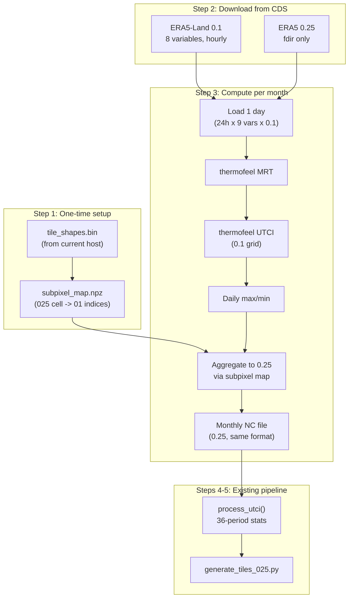

# High-Res UTCI via Clipped 0.25 Aggregation

## Goal

Replace the current UTCI (from ERA5-HEAT at 0.25) with a version computed at 0.1 from ERA5-Land, then aggregated into coastline-clipped 0.25 cells. Coastal cells get values computed only from their land portion. Interior cells are a simple area average. The final output is the same 0.25 grid — no UI changes needed.

## Prerequisites (already done on current host)

These files must be copied to the powerful host:

- `data/tiles/tile_shapes.bin` — clipped coastal cell polygons (5.4 MB)
- `data/tiles/manifest.json` — current manifest
- `data/natural_earth/` — NE 10m shapefiles (land + minor islands)
- `~/.cdsapirc` — CDS API credentials

Python dependencies: `pip install cdsapi xarray netcdf4 numpy shapely thermofeel pyshp`

## Exact steps to produce new UTCI tiles

### Step 1: Build sub-pixel mapping table

**Script:** `data/build_subpixel_map.py` (new)

For each 0.25 land cell, determine which 0.1 grid indices fall inside the clipped shape:
- Load `tile_shapes.bin` for coastal cell polygons
- For interior cells (not in tile_shapes.bin), all ~6 sub-pixels map to the cell
- For coastal cells, test which 0.1 cell centers fall inside the clipped polygon
- Output: `data/subpixel_map.npz` — sparse mapping `{cell_025_index: [cell_01_indices]}`

This is a one-time computation, ~10 min, no downloads needed.

### Step 2: Download ERA5-Land + ERA5 fdir

**Script:** `data/download_era5land_utci.py` (new)

**CDS datasets:**
- `reanalysis-era5-land` (0.1 degree): `2m_temperature`, `2m_dewpoint_temperature`, `10m_u_component_of_wind`, `10m_v_component_of_wind`, `surface_solar_radiation_downwards`, `surface_net_solar_radiation`, `surface_thermal_radiation_downwards`, `surface_net_thermal_radiation`
- `reanalysis-era5-single-levels` (0.25 degree): `total_sky_direct_solar_radiation` (fdir)

**Strategy:** Same as existing downloaders — submit all 10 year requests in parallel, download one month at a time. Process each month immediately (Step 3), then delete raw files.

**Per-month raw download size:**
- ERA5-Land: 8 variables x ~2 GB each = ~16 GB per month
- ERA5 fdir: ~2 GB per month
- Total raw per month: ~18 GB (peak disk, deleted after processing)

**Total download volume:** ~1.7 TB over CDS API. Estimate 2-4 days with 10 parallel requests.

### Step 3: Compute UTCI at 0.1 and aggregate to 0.25

**Script:** `data/compute_utci_hires.py` (new)

For each downloaded month, process **one day at a time** to stay within memory:

```
For each day (24 hourly timesteps):
  1. Load ERA5-Land 0.1 data: T2m, Td2m, u10, v10, ssrd, ssr, strd, str
  2. Load ERA5 0.25 fdir, interpolate to 0.1 via nearest-neighbor
  3. Compute derived variables:
     - wind speed: ws = sqrt(u^2 + v^2)
     - vapor pressure from Td2m
     - solar zenith angle (thermofeel)
     - convert accumulated radiation J/m2 -> W/m2
  4. Compute MRT: thermofeel.calculate_mean_radiant_temperature()
  5. Compute UTCI: thermofeel.calculate_utci(t2m, ws10, mrt, e_hPa)
  6. -> hourly UTCI at 0.1 (shape: 24 x 1501 x 3600)
  7. Daily max and daily min from 24 values
  8. Aggregate to 0.25 using subpixel_map:
     For each 0.25 cell, average the mapped 0.1 sub-pixels
  9. -> daily max/min UTCI at 0.25 (shape: 1 x 601 x 1440)
```

**Memory per day:** 24h x 5.4M cells x 4 bytes x 9 variables = ~4.7 GB. Fits in 32 GB.

**Output per month:** `data/raw_025/utci_daily/{YYYY}-{MM}.nc` with `utci_daily_max` and `utci_daily_min` — same format as current UTCI files.

### Step 4: Process period stats (existing pipeline)

```bash
cd /path/to/goldilocks
python -c "
import sys; sys.path.insert(0, 'data')
from process_periods_025 import process_utci, OUT_DIR
OUT_DIR.mkdir(parents=True, exist_ok=True)
process_utci('day')
process_utci('night')
"
```

This reads the monthly files from Step 3 and produces `utci_day_periods.nc` and `utci_night_periods.nc` — ~2 min each.

### Step 5: Regenerate tiles

```bash
python data/generate_tiles_025.py
python data/generate_travel_safety.py
```

Or: `python data/pipeline.py tiles safety`

### Step 6: Copy results back

Only these files need to come back to the deploy host:
- `data/processed/utci_day_periods.nc` (~870 MB)
- `data/processed/utci_night_periods.nc` (~870 MB)
- `data/raw_025/utci_daily/*.nc` (120 monthly files, ~25 GB total — needed for future reprocessing)

Then regenerate tiles on the deploy host, or copy the entire `data/tiles/` directory.

## Data flow diagram



## Key technical details

- **fdir interpolation:** Nearest-neighbor from 0.25 to 0.1. Same approach as the CHI paper (Nature Scientific Data, 2026).
- **Radiation units:** ERA5/ERA5-Land radiation is accumulated J/m2 per hour. Convert to W/m2 by dividing by 3600.
- **Solar zenith angle:** Use `thermofeel.calculate_cos_solar_zenith_angle_integrated()` with tbegin/tend for each hourly interval. Average only over sunlit portion to avoid spikes at sunrise/sunset.
- **Longitude convention:** ERA5-Land uses -180..180. Must shift to 0..360 for the 0.25 output grid (same issue we fixed for ERA5-HEAT UTCI).
- **Latitude:** ERA5-Land covers 90N to 90S at 0.1. Slice to 90N-60S (1501 rows) to match our grid.
- **thermofeel UTCI validity range:** T2m -50 to +50°C, Tmrt-T2m -30 to +70°C, wind 0.5-17 m/s. Values outside produce NaN.

## Estimated compute time on a powerful host

- Download: 2-4 days (CDS throughput bottleneck)
- UTCI computation: ~30s per day x 3650 days = ~30 hours
- Period stats: ~5 min
- Tile generation: ~15 min
- **Total: 2-5 days, dominated by CDS download**
